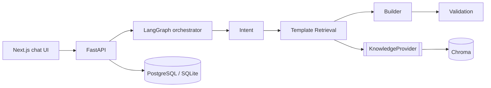

# Intelligent Feedback & Assessment Platform (IFAP)

Describe a business need in chat and get back a validated questionnaire, built by a pipeline of
AI agents on top of a RAG knowledge base of curated templates.



## Quick start (no API keys needed)
```bash
make install      # venv + pip + npm
make api          # http://localhost:8000/docs  (SQLite + embedded Chroma, auto-ingests 200 templates)
make web          # http://localhost:3000
```
Full stack with Postgres and the Chroma server: `make up`.

## LLM: on, off and fallback
The Intent and Builder agents try the LLM first and fall back to deterministic heuristics when it is
**switched off, not configured, unreachable, or returns unusable output**. The agent trace shows
which strategy ran and why (e.g. `fallback: LLM switched off`).

Free local LLM with [Ollama](https://ollama.com), a standalone app rather than a pip package:
```bash
brew install ollama && ollama serve        # terminal 1
ollama pull qwen3:8b
export IFAP_LLM__PROVIDER=ollama           # localhost:11434 and qwen3:8b are the defaults
make api
```

| Setting | Values | Default |
|---|---|---|
| `IFAP_LLM__PROVIDER` | `disabled` · `ollama` · `openai_compatible` | `disabled` (`openai_compatible` if an API key is set) |
| `IFAP_LLM__ENABLED` | switch position at startup | `true` |
| `IFAP_LLM__MODEL` / `IFAP_LLM__BASE_URL` / `IFAP_LLM__API_KEY` | override the provider defaults | - |
| `IFAP_LLM__TIMEOUT_SECONDS` / `IFAP_LLM__MAX_RETRIES` | per-call limits before falling back | `60` (`180` for ollama) / `1` |
| `IFAP_LLM__REASONING_EFFORT` | e.g. `none`, `low` (thinking models like qwen3) | `none` for ollama (≈100 s → ≈18 s per call) |
| `IFAP_WORKFLOW__BUILDER_LLM_MAX_CANDIDATES` | candidate questions shown to the Builder LLM | `20` |

Flip it at runtime (no restart) with the toggle in the UI header, or with
`curl -X PUT localhost:8000/api/v1/llm -H 'content-type: application/json' -d '{"enabled": false}'`.
The switch applies to the whole API process and resets to `IFAP_LLM__ENABLED` on restart.

## LLM providers, model chain and rate limits
| Use | Provider | How |
|---|---|---|
| Development | **Ollama** `qwen3:8b`, local, unlimited and free | `make api` (reads `backend/.env`) |
| Real users / cloud | **Gemini** via its OpenAI-compatible endpoint | deploy (reads Secret Manager), or `make api-gemini` locally |

Gemini's free tier is limited **per model** (verified for `gemini-2.5-flash`: 5 requests/minute
and 20/day), so IFAP uses a **model chain**: `gemini-3.6-flash` → `gemini-2.5-flash` →
`gemini-3.1-flash-lite` (override with `IFAP_LLM__MODEL` / `IFAP_LLM__FALLBACK_MODELS`).
Per model:

| Response | What IFAP does |
|---|---|
| over the per-minute pace | queues (≤ 65 s, `IFAP_LLM__RATE_LIMIT_MAX_WAIT_SECONDS`) |
| 429, short back-off | waits for the provider's `retryDelay`, retries the same model |
| 429, daily quota (long back-off) | skips the model until its quota resets |
| 5xx / timeout | skips the model for 60 s (`IFAP_LLM__MODEL_COOLDOWN_SECONDS`) |
| 404 | skips the model for the life of the process |
| 401 / 400 | stops: every model would fail the same way |

Only when no model can answer does an agent fall back to its heuristic. **The model is always
visible:** the header shows the model the next call will use (▾ opens the chain, with when each
exhausted model comes back), every trace row has a *Model* column, the chat summary lists
`agent → model`, and MCP results say `intent: llm via gemini-3.6-flash`.

## Workflows: standard and autonomous
`IFAP_WORKFLOW__WORKFLOWS` defines named agent graphs. Each workflow lists its `steps`, plus
`routes` that map an agent's *signal* to a next step, which is how loops are configured.

| Workflow | Steps | Behaviour |
|---|---|---|
| `standard` (default) | intent → template_retrieval → questionnaire_builder → validation | Fixed pipeline; one LLM call per LLM-backed agent |
| `autonomous` | intent → template_retrieval → **autonomous_builder** → validation ↺ | The builder runs a **tool loop** (`search_templates`, `submit_draft`), reads validation feedback and revises until accepted. Validation's `invalid`/`incomplete` signals route back to the builder (capped at 2 visits). Guardrails: `IFAP_WORKFLOW__AUTONOMOUS_MAX_TOOL_CALLS` (8) and `..._MAX_SECONDS` (600). |

Choose a workflow per request: `{"message": "...", "workflow": "autonomous"}`, or with the
picker in the UI header.

## MCP server (Claude Desktop, Claude Code)
IFAP is also an MCP server. It's a second way in, next to the REST API, using the same services.

| Tool | Purpose |
|---|---|
| `get_platform_status` | Workflows, agents, LLM state, knowledge size |
| `list_survey_types` / `search_templates` | Explore the template knowledge base (RAG) |
| `generate_questionnaire` | Run IFAP's agents (`workflow`: `standard` or `autonomous`). Waits up to 40 s (`IFAP_MCP__WAIT_SECONDS`); longer runs return a `job_id` |
| `get_generation_result` | Poll a running job: status, agent steps finished so far, and the result |
| `build_questionnaire_from_templates` | Claude acts as the builder: pick template ids, get validation feedback |
| `get_questionnaire` / `list_questionnaires` / `publish_questionnaire` | Review and manage |
| `set_llm_enabled` | Switch IFAP's own LLM strategies on/off (this process only) |

**Claude Desktop:** add this to `~/Library/Application Support/Claude/claude_desktop_config.json`,
then quit and reopen Claude Desktop (Cmd+Q):
```json
{ "mcpServers": { "ifap": {
    "command": "/ABSOLUTE/PATH/survey_and_analytics/backend/.venv/bin/ifap-mcp", "args": [] } } }
```
**Claude Code:** `claude mcp add ifap -- /ABSOLUTE/PATH/backend/.venv/bin/ifap-mcp`
**HTTP transport** (remote clients): `ifap-mcp --transport http --port 8100` serves `/mcp`.

The MCP process reads `backend/.env` (so Ollama works), keeps its knowledge base in memory, logs
to stderr, and shares the SQLite database with the API: questionnaires created in Claude
Desktop show up in the API too.

## Deployment (Google Cloud Run + Vercel + Neon)
```
Vercel UI ─┐
           ├─► Cloud Run: ifap-api ──► Neon Postgres      (secrets in Secret Manager)
Cloud Run UI┘                     └──► Gemini API (OpenAI-compatible; heuristics if absent)
```
1. **Secrets:** create `backend/.env.cloud` (git-ignored) with `IFAP_DATABASE__URL=` (Neon
   connection string, as shown in the Neon console) and `IFAP_LLM__API_KEY=` (Gemini key).
2. **Preflight:** `cd backend && .venv/bin/python scripts/cloud_preflight.py` checks Neon
   (region, connectivity, migrations) and Gemini (models, one real call). It never prints secrets.
3. **One-time GCP setup:** `GCP_PROJECT=<id> GCP_REGION=<region> ./infrastructure/gcp/setup.sh`
   (APIs, registry, least-privilege service accounts, Secret Manager, keyless GitHub federation).
4. **Deploy:** `GCP_PROJECT=<id> GCP_REGION=<region> ./infrastructure/gcp/deploy.sh` builds on
   Cloud Build and prints both URLs. After that, every green CI run on `main` redeploys via
   `.github/workflows/deploy.yml` (set the 4 repository variables that `setup.sh` prints).
5. **Vercel:** import the GitHub repo, set root directory `frontend`, and add the environment
   variable `NEXT_PUBLIC_IFAP_API_URL=<API URL>`. Vercel URLs matching `https://ifap*.vercel.app`
   are allowed by the API's CORS policy.

Schema changes go through Alembic migrations (`backend/src/ifap/adapters/persistence/migrations`),
applied automatically on start-up. A drift test fails if a model changes without a migration.

## Quality gate
`make check` runs black, ruff, pylint, pyright (strict), and the unit, integration and
architecture tests. CI runs the same steps.

## Documentation
| # | Document |
|---|---|
| 1 | [Vision](docs/01-vision.md) |
| 2 | [Product Requirements](docs/02-product-requirements.md) |
| 3 | [Architecture Decision Records](docs/03-architecture-decision-records.md) |
| 4 | [Domain Model](docs/04-domain-model.md) |
| 5 | [Sequence Diagrams](docs/05-sequence-diagrams.md) |
| 6 | [Agent Design](docs/06-agent-design.md) |
| 7 | [RAG Design](docs/07-rag-design.md) |
| 8 | [API Specification](docs/08-api-specification.md) |
| 9 | [Deployment Strategy](docs/09-deployment-strategy.md) |
| 10 | [Security Architecture](docs/10-security-architecture.md) |
| 11 | [Testing Strategy](docs/11-testing-strategy.md) |
| 12 | [Coding Standards](docs/12-coding-standards.md) |
| 13 | [Folder Structure](docs/13-folder-structure.md) |
| 14 | [Sprint Plan](docs/14-sprint-plan.md) |
| 15 | [Future Roadmap](docs/15-future-roadmap.md) |

## Adding an agent (no core changes)
```python
@agent_plugin(AgentDescriptor(name="sentiment", version="1.0.0", description="..."))
class SentimentAgent(BaseAgent):
    @classmethod
    def create(cls, deps: AgentDependencies) -> Self: ...
    async def _execute(self, state: WorkflowState) -> AgentOutcome: ...
```
Then register its module (`IFAP_WORKFLOW__PLUGIN_MODULES` or an `ifap.agents` entry point) and
add `"sentiment"` to a workflow's `steps` in `IFAP_WORKFLOW__WORKFLOWS`.
