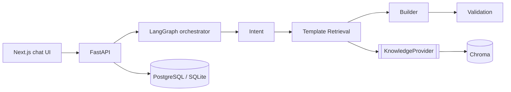

# Intelligent Feedback & Assessment Platform (IFAP)

Describe a business need in chat and get back a validated questionnaire, built by a pipeline of
AI agents on top of a RAG knowledge base of curated templates.



## Quick start (no API keys needed)
```bash
make install      # venv + pip + npm
make api          # http://localhost:8000/docs  (SQLite + embedded Chroma, auto-ingests 200 templates)
make web          # http://localhost:3000
```
Full stack with Postgres and the Chroma server: `make up`.

## LLM: on, off and fallback
The Intent and Builder agents try the LLM first and fall back to deterministic heuristics when it is
**switched off, not configured, unreachable, or returns unusable output**. The agent trace shows
which strategy ran and why (e.g. `fallback: LLM switched off`).

Free local LLM with [Ollama](https://ollama.com), a standalone app rather than a pip package:
```bash
brew install ollama && ollama serve        # terminal 1
ollama pull qwen3:8b
export IFAP_LLM__PROVIDER=ollama           # localhost:11434 and qwen3:8b are the defaults
make api
```

| Setting | Values | Default |
|---|---|---|
| `IFAP_LLM__PROVIDER` | `disabled` · `ollama` · `openai_compatible` | `disabled` (`openai_compatible` if an API key is set) |
| `IFAP_LLM__ENABLED` | switch position at startup | `true` |
| `IFAP_LLM__MODEL` / `IFAP_LLM__BASE_URL` / `IFAP_LLM__API_KEY` | override the provider defaults | - |
| `IFAP_LLM__TIMEOUT_SECONDS` / `IFAP_LLM__MAX_RETRIES` | per-call limits before falling back | `60` (`180` for ollama) / `1` |
| `IFAP_LLM__REASONING_EFFORT` | e.g. `none`, `low` (thinking models like qwen3) | `none` for ollama (≈100 s → ≈18 s per call) |
| `IFAP_WORKFLOW__BUILDER_LLM_MAX_CANDIDATES` | candidate questions shown to the Builder LLM | `20` |

Flip it at runtime (no restart) with the toggle in the UI header, or with
`curl -X PUT localhost:8000/api/v1/llm -H 'content-type: application/json' -d '{"enabled": false}'`.
The switch applies to the whole API process and resets to `IFAP_LLM__ENABLED` on restart.

## Quality gate
`make check` runs black, ruff, pylint, pyright (strict), and the unit, integration and
architecture tests. CI runs the same steps.

## Documentation
| # | Document |
|---|---|
| 1 | [Vision](docs/01-vision.md) |
| 2 | [Product Requirements](docs/02-product-requirements.md) |
| 3 | [Architecture Decision Records](docs/03-architecture-decision-records.md) |
| 4 | [Domain Model](docs/04-domain-model.md) |
| 5 | [Sequence Diagrams](docs/05-sequence-diagrams.md) |
| 6 | [Agent Design](docs/06-agent-design.md) |
| 7 | [RAG Design](docs/07-rag-design.md) |
| 8 | [API Specification](docs/08-api-specification.md) |
| 9 | [Deployment Strategy](docs/09-deployment-strategy.md) |
| 10 | [Security Architecture](docs/10-security-architecture.md) |
| 11 | [Testing Strategy](docs/11-testing-strategy.md) |
| 12 | [Coding Standards](docs/12-coding-standards.md) |
| 13 | [Folder Structure](docs/13-folder-structure.md) |
| 14 | [Sprint Plan](docs/14-sprint-plan.md) |
| 15 | [Future Roadmap](docs/15-future-roadmap.md) |

## Adding an agent (no core changes)
```python
@agent_plugin(AgentDescriptor(name="sentiment", version="1.0.0", description="..."))
class SentimentAgent(BaseAgent):
    @classmethod
    def create(cls, deps: AgentDependencies) -> Self: ...
    async def _execute(self, state: WorkflowState) -> AgentOutcome: ...
```
Then register its module (`IFAP_WORKFLOW__PLUGIN_MODULES` or an `ifap.agents` entry point) and
add `"sentiment"` to `IFAP_WORKFLOW__PIPELINE`.
