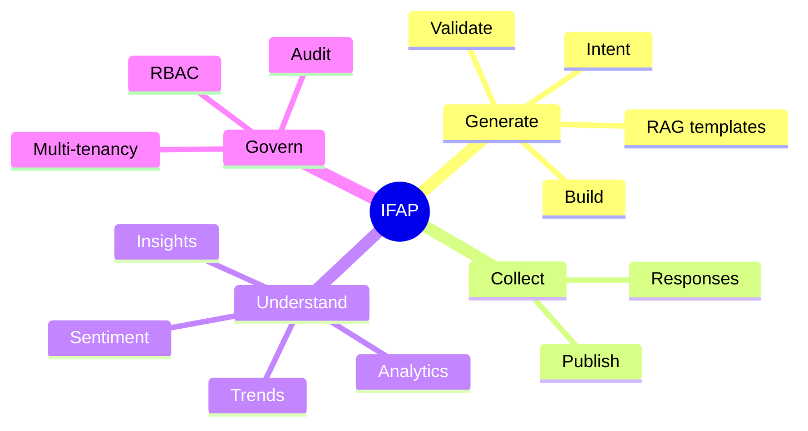

# 1. Vision Document - Intelligent Feedback & Assessment Platform (IFAP)

## Problem
Organisations maintain questionnaires by hand - customer feedback, employee engagement,
compliance reviews, risk and vendor assessments, healthcare intake, audits. Each is authored
from scratch, drifts out of date, duplicates questions found elsewhere, and is analysed manually.

## Vision
> *Describe the business need in a sentence; get a validated, best-practice questionnaire in
> seconds; collect responses; let AI agents turn them into insight.*

IFAP is a **multi-agent platform**: questionnaire generation is the first use case, while
analytics, insights, recommendations, sentiment, trend, quality, compliance and risk agents plug
into the same framework later without changing existing code.

## Value
| Stakeholder | Today | With IFAP |
|---|---|---|
| Survey author | Days to draft, inconsistent quality | Minutes; grounded in a curated template library |
| Compliance / Risk | Hard to prove coverage of controls | Questions carry business tags & lineage to templates |
| Analysts | Manual export + spreadsheet analysis | Analytics & insight agents (Phase 2+) |
| Platform team | One-off tools per department | One extensible agent platform |

## Principles
1. **Grounded AI** - the LLM selects and adapts *curated* questions; it never invents answer schemas.
2. **Human in the loop** - every generated questionnaire is a draft the user reviews.
3. **Replaceable everything** - LLM, vector store, database and agents sit behind ports.
4. **Works without an LLM** - deterministic fallbacks keep the platform usable and testable.
5. **Observable by default** - every agent step is traced, timed and returned to the client.

## Success metrics
- Time-to-first-draft < 30 s (p95)
- ≥ 80 % of generated questions kept unchanged by reviewers
- 0 structurally invalid questionnaires reach "published"
- New agent shipped without modifying the core (measured per agent)

