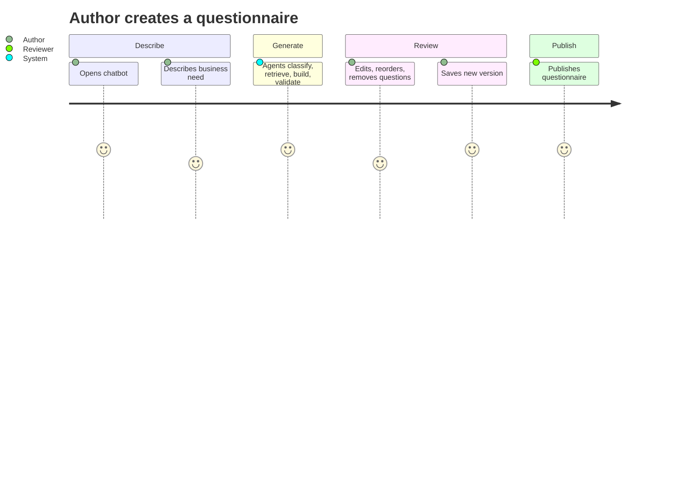

# 2. Product Requirements Document

## Personas
- **Survey Author** (HR partner, CX manager, compliance officer) - needs a good questionnaire fast.
- **Reviewer / Approver** - checks and publishes.
- **Respondent** - answers the questionnaire (Phase 2).
- **Analyst** - consumes reports and AI insights (Phase 2).
- **Platform Admin** - manages templates, agents, tenants, roles (Phase 3).

## User journey

## Functional requirements
| ID | Requirement | Phase | Status |
|---|---|---|---|
| FR-01 | Chat UI accepts a free-text business need | 1 | ✅ |
| FR-02 | Intent Agent classifies survey type, audience, count, keywords | 1 | ✅ |
| FR-03 | Template Retrieval Agent fetches templates via RAG with metadata filters | 1 | ✅ |
| FR-04 | Builder Agent assembles N questions with category coverage and skip logic | 1 | ✅ |
| FR-05 | Validation Agent checks ids, duplicates, dependency integrity; auto-repairs safe issues | 1 | ✅ |
| FR-06 | User edits title/questions; each save creates a new version | 1 | ✅ |
| FR-07 | Publish locks a questionnaire (immutable) | 1 | ✅ |
| FR-08 | Ingestion pipeline loads templates into the vector store | 1 | ✅ |
| FR-09 | Agent catalogue endpoint lists registered agents and pipeline | 1 | ✅ |
| FR-10 | Respondents submit answers honouring skip logic & validations | 2 | ⏳ |
| FR-11 | Analytics service aggregates responses per question | 2 | ⏳ |
| FR-12 | Reporting dashboard | 2 | ⏳ |
| FR-13 | Agent marketplace (enable/disable/version agents per tenant) | 3 | ⏳ |
| FR-14 | Enterprise RBAC and multi-tenancy | 3 | ⏳ |

## Question model (supported)
Answer types: Boolean, Multiple Choice, Single Choice, Rich Text, Numeric, Date, File Upload.
Skip logic: `dependency_rules` (`depends_on`, `operator`, `value`, `action`).
Each question: `id, label, category, description, answer_type, choices, validations,
dependency_rules, business_tags`.

## Non-functional requirements
| Area | Requirement |
|---|---|
| Performance | Generation p95 < 3 s heuristic, < 30 s with LLM |
| Availability | 99.9 % API (Phase 3 target) |
| Quality | pyright strict, ruff, pylint 10/10, black; tests in CI |
| Security | OWASP ASVS L2; secrets only via environment/secret store |
| Extensibility | New agent = new module + config entry, zero core edits |
| Portability | Runs offline (no LLM, no network) for dev/test |

## Out of scope (Phase 1)
Response collection, dashboards, authentication, tenant isolation, Alembic migrations.
