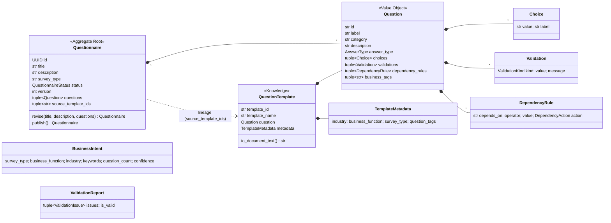
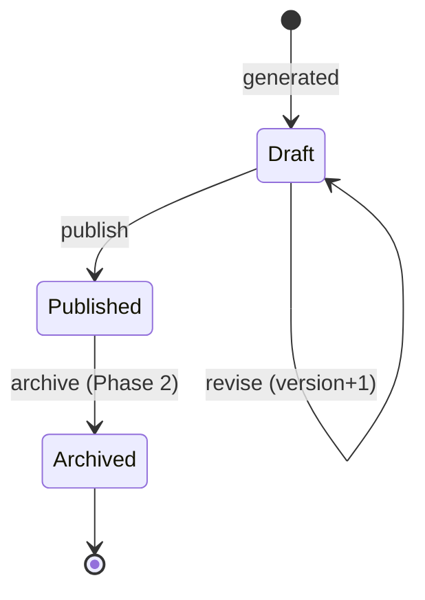

# 4. Domain Model

Bounded contexts: **Questionnaire Authoring** (Phase 1), **Knowledge** (Phase 1),
**Response Collection** and **Analytics** (Phase 2), **Tenancy & Access** (Phase 3).

## Invariants
| Invariant | Enforced in |
|---|---|
| Single/multiple choice questions have ≥ 2 choices; other types have none | `Question` validator |
| Only `draft` questionnaires can be revised or published | `Questionnaire._ensure_editable` |
| A published questionnaire has ≥ 1 question | `Questionnaire.publish` |
| Every revision increments `version` | `Questionnaire.revise` |
| Question ids are unique | `domain.validation.rule_unique_ids` |
| Skip logic references only *earlier* questions (prevents cycles) | `rule_dependencies_reference_earlier_questions` |

## Lifecycle

## Domain events
`QuestionnaireGenerated`, `QuestionnaireRevised`, `QuestionnairePublished`, `KnowledgeIngested`.
Phase 2 adds `ResponseSubmitted` and `AnalyticsComputed`.
