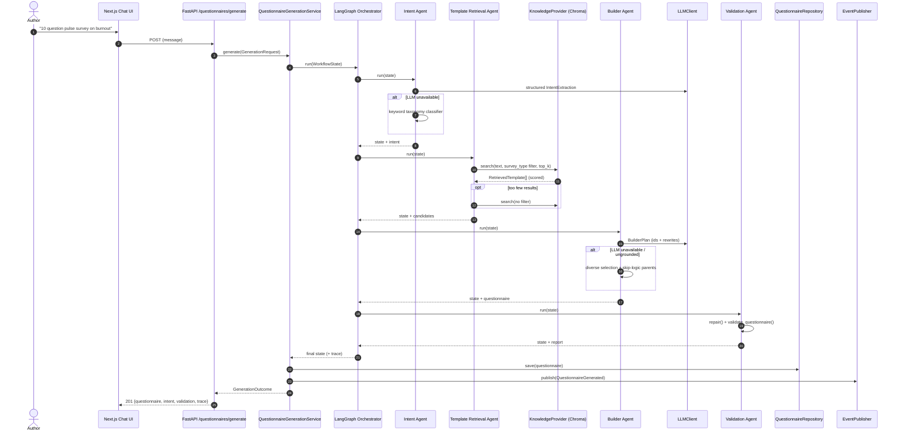
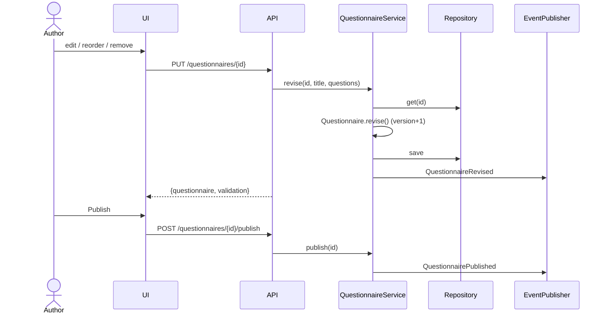
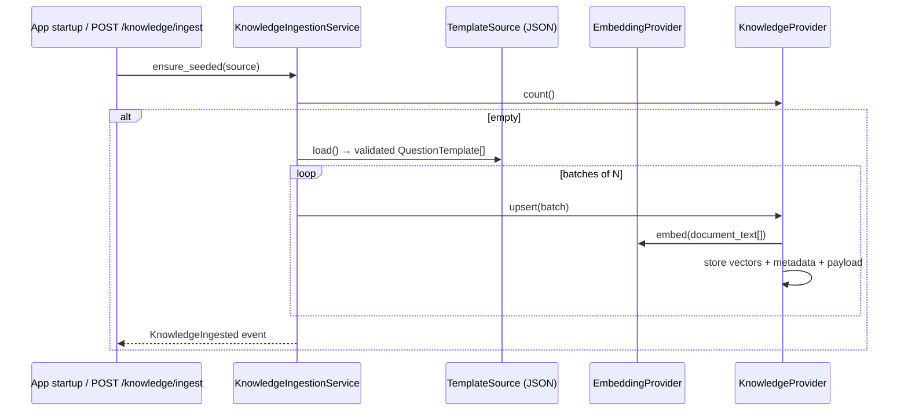
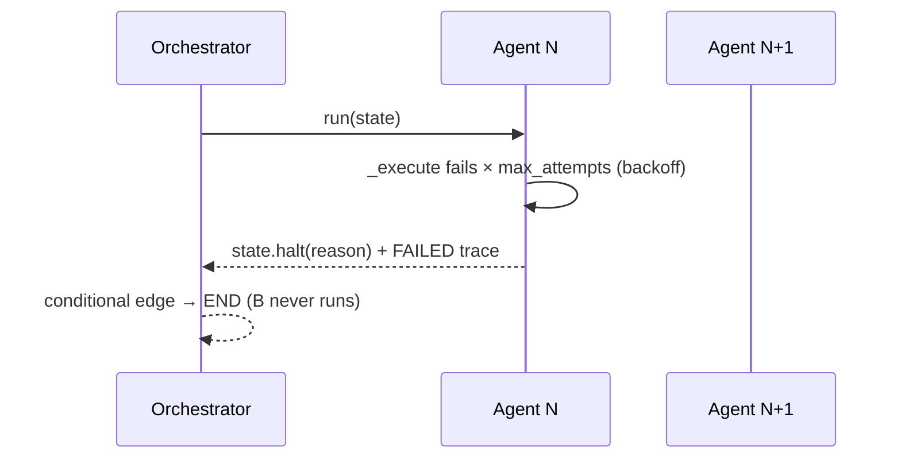

# 5. Sequence Diagrams

## 5.1 Generate a questionnaire

```mermaid
sequenceDiagram
  autonumber
  actor U as Author
  participant UI as Next.js Chat UI
  participant API as FastAPI /questionnaires/generate
  participant S as QuestionnaireGenerationService
  participant O as LangGraph Orchestrator
  participant IA as Intent Agent
  participant RA as Template Retrieval Agent
  participant KB as KnowledgeProvider (Chroma)
  participant BA as Builder Agent
  participant LLM as LLMClient
  participant VA as Validation Agent
  participant R as QuestionnaireRepository
  participant E as EventPublisher

  U->>UI: "10 question pulse survey on burnout"
  UI->>API: POST {message}
  API->>S: generate(GenerationRequest)
  S->>O: run(WorkflowState)
  O->>IA: run(state)
  IA->>LLM: structured IntentExtraction
  alt LLM unavailable
    IA->>IA: keyword taxonomy classifier
  end
  IA-->>O: state + intent
  O->>RA: run(state)
  RA->>KB: search(text, survey_type filter, top_k)
  KB-->>RA: RetrievedTemplate[] (scored)
  opt too few results
    RA->>KB: search(no filter)
  end
  RA-->>O: state + candidates
  O->>BA: run(state)
  BA->>LLM: BuilderPlan (ids + rewrites)
  alt LLM unavailable / ungrounded
    BA->>BA: diverse selection + skip-logic parents
  end
  BA-->>O: state + questionnaire
  O->>VA: run(state)
  VA->>VA: repair() + validate_questionnaire()
  VA-->>O: state + report
  O-->>S: final state (+ trace)
  S->>R: save(questionnaire)
  S->>E: publish(QuestionnaireGenerated)
  S-->>API: GenerationOutcome
  API-->>UI: 201 {questionnaire, intent, validation, trace}
```

## 5.2 Review, revise, publish

```mermaid
sequenceDiagram
  actor U as Author
  participant UI
  participant API
  participant QS as QuestionnaireService
  participant R as Repository
  participant E as EventPublisher
  U->>UI: edit / reorder / remove
  UI->>API: PUT /questionnaires/{id}
  API->>QS: revise(id, title, questions)
  QS->>R: get(id)
  QS->>QS: Questionnaire.revise() (version+1)
  QS->>R: save
  QS->>E: QuestionnaireRevised
  API-->>UI: {questionnaire, validation}
  U->>UI: Publish
  UI->>API: POST /questionnaires/{id}/publish
  API->>QS: publish(id)
  QS->>E: QuestionnairePublished
```

## 5.3 Knowledge ingestion

```mermaid
sequenceDiagram
  participant Boot as App startup / POST /knowledge/ingest
  participant IS as KnowledgeIngestionService
  participant Src as TemplateSource (JSON)
  participant EP as EmbeddingProvider
  participant KB as KnowledgeProvider
  Boot->>IS: ensure_seeded(source)
  IS->>KB: count()
  alt empty
    IS->>Src: load() → validated QuestionTemplate[]
    loop batches of N
      IS->>KB: upsert(batch)
      KB->>EP: embed(document_text[])
      KB->>KB: store vectors + metadata + payload
    end
    IS-->>Boot: KnowledgeIngested event
  end
```

## 5.4 Agent halt short-circuit

```mermaid
sequenceDiagram
  participant O as Orchestrator
  participant A as Agent N
  participant B as Agent N+1
  O->>A: run(state)
  A->>A: _execute fails × max_attempts (backoff)
  A-->>O: state.halt(reason) + FAILED trace
  O-->>O: conditional edge → END (B never runs)
```
