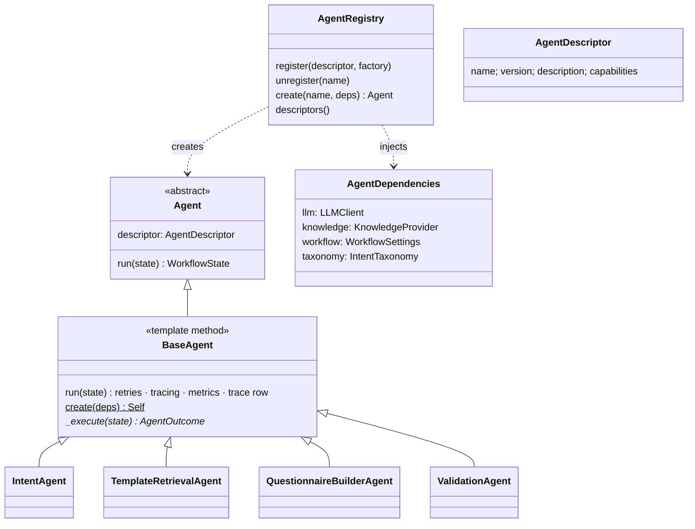
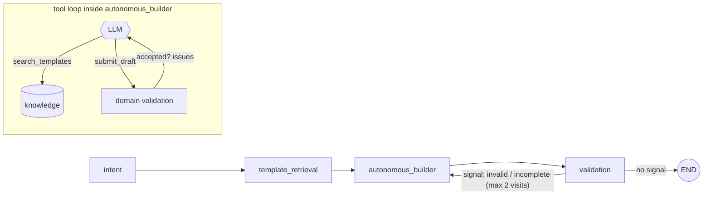
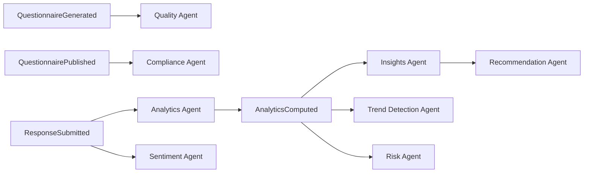

# 6. Agent Design Document

## Framework


**Blackboard state.** Agents communicate only through the immutable `WorkflowState`
(`request → intent → candidates → questionnaire → validation`, plus `trace`, `halted`). Each
agent reads what it needs and returns a new copy, so there are no hidden side channels.

**Cross-cutting concerns** live in `BaseAgent.run`:
- OpenTelemetry span `agent.<name>`
- metrics `ifap.agent.runs` and `ifap.agent.duration`
- retries with linear backoff (`agent_max_attempts`, `agent_retry_backoff_seconds`)
- an `AgentTrace` row
- `state.halt()` after the last failure

## Workflows, signals and loops (ADR-010)

Named workflows (`standard`, `autonomous`) are compiled from configuration and chosen per
request. Agents emit **signals**, and the workflow's `routes` decide where a signal leads.

## Built-in agents
| Agent | Input | Output | LLM strategy | Fallback |
|---|---|---|---|---|
| `intent` | request | `BusinessIntent` | Structured `IntentExtraction` constrained to known survey types | Keyword scoring from `intent_taxonomy.json`, regex question count |
| `template_retrieval` | intent | `candidates` | n/a (RAG) | Broadens search when the filter yields too few |
| `questionnaire_builder` | intent, candidates | `Questionnaire` | `BuilderPlan` (ids + label rewrites), grounded check | Category round-robin + skip-logic parent inclusion |
| `validation` | questionnaire | repaired questionnaire + `ValidationReport` + signal | n/a | Deterministic repair (dangling rules, duplicates) |
| `autonomous_builder` | intent, candidates, previous validation | `Questionnaire` + tool-loop artifact | Tool loop: `search_templates`, `submit_draft` until accepted | Category round-robin selector |

## Patterns
**Add an agent** (no core change):
```python
@agent_plugin(AgentDescriptor(name="sentiment", version="1.0.0", description="..."))
class SentimentAgent(BaseAgent):
    @classmethod
    def create(cls, deps: AgentDependencies) -> Self: ...
    async def _execute(self, state: WorkflowState) -> AgentOutcome: ...
```
Then either ship it in a package with `[project.entry-points."ifap.agents"]`, or add the module
to `IFAP_WORKFLOW__PLUGIN_MODULES`, and add its name to a workflow's `steps` in `IFAP_WORKFLOW__WORKFLOWS`.

**Remove an agent:** drop it from the pipeline config (`registry.unregister` in tests).
**Version an agent:** bump `descriptor.version`. Run `v2` side-by-side under a new name
(`questionnaire_builder_v2`) and switch the pipeline per environment (canary).
**Test an agent:** construct it with fakes (`DisabledLLMClient`, `InMemoryKnowledgeProvider`)
and assert on the returned state and trace. See `tests/unit/test_agents.py`.

## Future agents (event-driven)

Synchronous agents run inside a LangGraph pipeline. Asynchronous agents subscribe to domain
events through `EventPublisher`. Both use the same `BaseAgent` contract.
