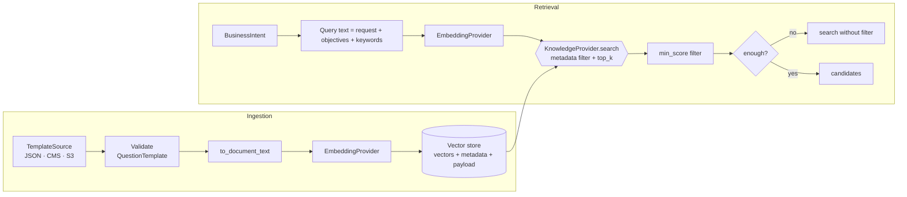

# 7. RAG Design Document

## Document schema
One **document per question** (the natural retrieval unit; questions are short, so no further
chunking is needed).

| Field | Purpose |
|---|---|
| `id` = `template_id` (e.g. `cs-006`) | Stable upsert key |
| `document` | `to_document_text()`: template, survey type, function, industry, category, question, description, choices, tags |
| `embedding` | From `EmbeddingProvider` (dimension configurable) |
| metadata `survey_type`, `business_function`, `industry`, `category`, `answer_type`, `tags` | Pre-filtering, faceting |
| metadata `payload` | Full `QuestionTemplate` JSON, so the domain object is rebuilt without a second lookup |

## Chunking strategy
- **Question-level chunks** (current): high precision, so a retrieved item is directly usable.
- **Template-level context** is embedded *into* each chunk (template name, survey type), giving
  short chunks domain context.
- **Long-form sources** (policy PDFs, audit standards; Phase 2) use 512-token chunks with
  64-token overlap and keep a `parent_id`. These become *context* for the Builder, not questions.

## Retrieval
1. Metadata pre-filter by `survey_type` from the Intent Agent.
2. Cosine similarity, `top_k = max(retrieval_top_k, 2 × question_count)`.
3. Drop results below `retrieval_min_score`.
4. Broaden (drop the filter) if candidates < requested count.
5. Builder re-ranks: category diversity, then skip-logic parents.

Roadmap: hybrid search (BM25 + vector with RRF fusion), cross-encoder semantic re-ranking,
MMR diversity, per-tenant namespaces.

## Provider portability
| Capability | Chroma (POC) | Pinecone | Azure AI Search | Weaviate |
|---|---|---|---|---|
| Vector search | ✅ | ✅ | ✅ | ✅ |
| Metadata filter | `where` | `filter` | OData `$filter` | `where` |
| Hybrid | ❌ (app-side) | sparse-dense | ✅ native | ✅ native |
| Semantic rerank | app-side | app-side | ✅ semantic ranker | reranker modules |
| Multi-tenancy | collection/tenant | namespaces | index per tenant / filter | native tenants |

Each provider is an adapter implementing `upsert / search / count`. The in-memory provider is
the behavioural reference. Embeddings are external, so vectors are identical across stores.

## Embeddings
- POC: `HashingEmbeddingProvider` (unigram + bigram feature hashing, light stemming,
  L2-normalised). It is deterministic, offline and has zero cost.
- Production: `OpenAICompatibleEmbeddingProvider` (`text-embedding-3-small`, 384–1536 dims).
  Changing the model requires re-indexing, so the model name should be stored in collection
  metadata (Phase 2).

## Growth to millions of questions
Use HNSW/IVF indexes in a managed store, partition by tenant and survey type, run batch
ingestion with idempotent upserts, run embedding jobs on a queue, and cache popular intents
(see the Prompt 5 deep-dive).
