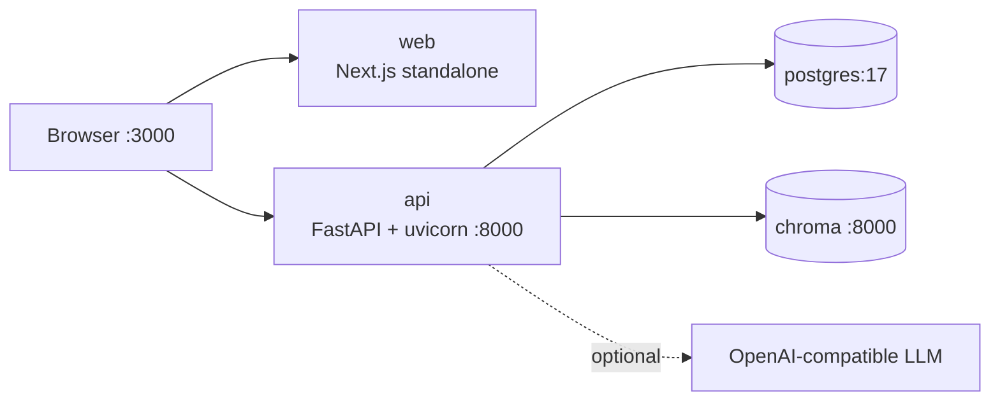
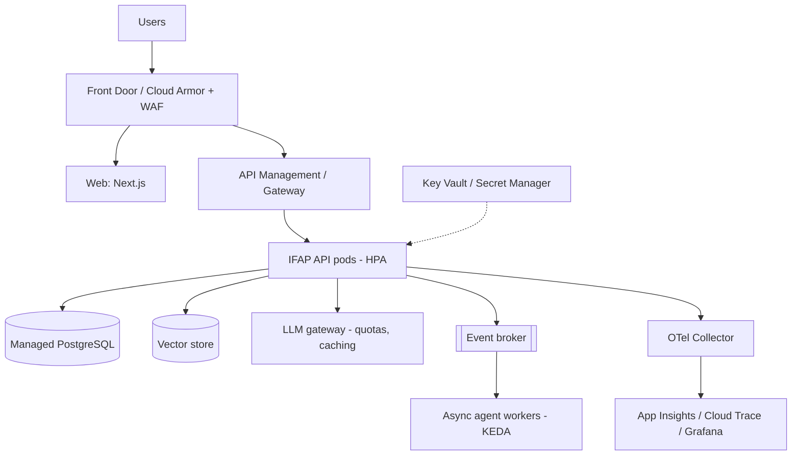
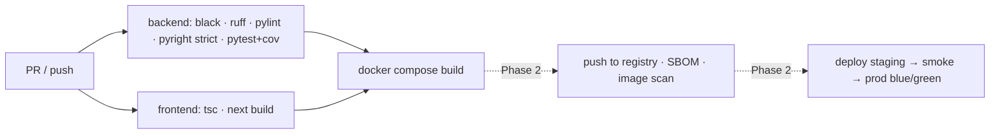

# 9. Deployment Strategy

## Environments
| Env | Runtime | DB | Vector | LLM |
|---|---|---|---|---|
| Local dev | `make api` + `make web` | SQLite | embedded Chroma (`backend/.chroma`) | none (heuristic) or any key |
| Docker | `make up` (docker compose) | PostgreSQL 17 | Chroma server | optional |
| Staging/Prod (target) | AKS / GKE / Azure Container Apps | Managed Postgres | Azure AI Search / Pinecone | Azure OpenAI / Vertex via OpenAI-compatible gateway |

## Local container topology

## Target cloud topology

## Pipeline (GitHub Actions, `.github/workflows/ci.yml`)

## Practices
- Images are multi-stage, slim, run as non-root and have health checks.
- Configuration comes only from environment variables (12-factor); secrets come from the platform
  secret store and are never baked into images.
- DB schema is `create_all` in Phase 1, moving to Alembic migrations run as a pre-deploy job.
- Ingestion is idempotent (upsert by `template_id`) and runs on startup if empty, or on demand.
- Rollback is the previous image tag. Agent versions are selected per environment through
  `IFAP_WORKFLOW__PIPELINE`.
