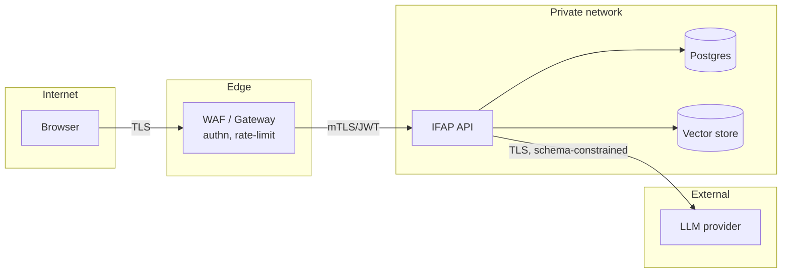

# 10. Security Architecture

## Threat model (STRIDE, abridged)
| Threat | Vector | Control (Phase) |
|---|---|---|
| Spoofing | Unauthenticated API calls | OIDC (Entra ID / Google) + JWT validation at the gateway and API (P3) |
| Tampering | Editing published questionnaires | Domain invariant: published ⇒ immutable (P1 ✅) |
| Repudiation | Who changed what | Domain events + versioned aggregates (P1 ✅) → audit log store (P2) |
| Information disclosure | Cross-tenant data, PHI in healthcare intake | Tenant id on every row and vector namespace, RLS in Postgres, encryption at rest (P3) |
| DoS / cost abuse | Prompt flooding the LLM | Rate limits at the gateway, per-tenant token budgets, LLM timeout (P1 ✅ timeout) |
| Elevation | Role escalation | RBAC: `author`, `reviewer`, `respondent`, `analyst`, `admin` (P3) |

## LLM-specific risks (OWASP LLM Top 10)
- **Prompt injection.** User text is passed only as the *user* message. The LLM output is
  schema-constrained (`with_structured_output`) and *grounded*: only ids from retrieved
  candidates are accepted (ADR-005).
- **Insecure output handling.** Outputs are validated by Pydantic plus domain validation before
  persistence. The UI renders them as text, never as HTML.
- **Sensitive data exposure.** No PII is sent in prompts other than the user's own request.
  Phase 3 adds a PII-redaction step before LLM calls.
- **Model DoS / overreliance.** Timeouts, retries with a budget, and a deterministic fallback.

## Data protection
- TLS everywhere. Postgres and vector store encryption at rest. Secrets are held in `SecretStr`
  (never logged) and sourced from Key Vault / Secret Manager.
- Healthcare intake data (PHI) uses dedicated tenants and region pinning, plus a HIPAA/GDPR
  retention policy driven by question `business_tags`.
- File uploads (Phase 2) go to object storage with pre-signed URLs, AV scanning, and
  type/size validation (already part of the question model).

## Trust boundaries

## Supply chain
Pinned dependencies with lockfiles, Dependabot, image scanning (Trivy) and an SBOM in CI (P2).
Agent plugins from third parties are allow-listed by module name in configuration.
