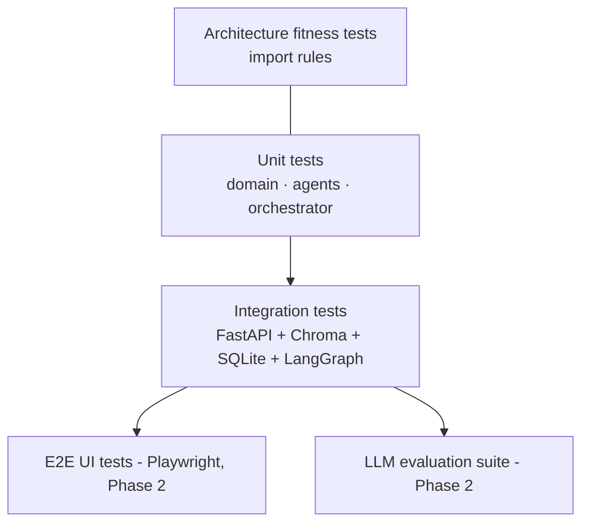

# 11. Testing Strategy

| Level | Location | What | Tooling |
|---|---|---|---|
| Architecture | `tests/architecture/` | Hexagonal dependency direction, framework-free domain, only the composition root imports adapters | `ast` + pytest |
| Unit | `tests/unit/` | Domain invariants, validation rules, each agent with fakes, registry/retry, orchestrator halting | pytest, pytest-asyncio |
| Integration | `tests/integration/` | Real app via `TestClient` (lifespan, ingestion), real Chroma in a temp dir, SQLite | pytest `-m integration` |
| Contract | OpenAPI schema | Frontend types mirror `/openapi.json` (codegen in Phase 2) | openapi-typescript |
| LLM eval (P2) | `tests/evals/` | Golden prompts → intent accuracy, grounding rate, coverage of categories; LLM-as-judge for label quality | pytest + recorded fixtures |
| Load (P2) | `tests/load/` | p95 latency for generate | k6 / Locust |

## Principles
- **Deterministic by default.** The hashing embedder and heuristic agents make the whole pipeline
  reproducible, so tests never call a paid LLM.
- **Fakes over mocks.** Use `DisabledLLMClient`, `InMemoryKnowledgeProvider` and
  `InMemoryEventBus`, which are real port implementations.
- **Provider conformance.** Every new `KnowledgeProvider` must pass the same behavioural suite as
  the in-memory reference (filtering, ranking, upsert idempotency).
- **Gate.** CI fails on any black/ruff/pylint/pyright violation or test failure. Coverage is
  reported via `pytest --cov`.

Run everything with `make check`.
