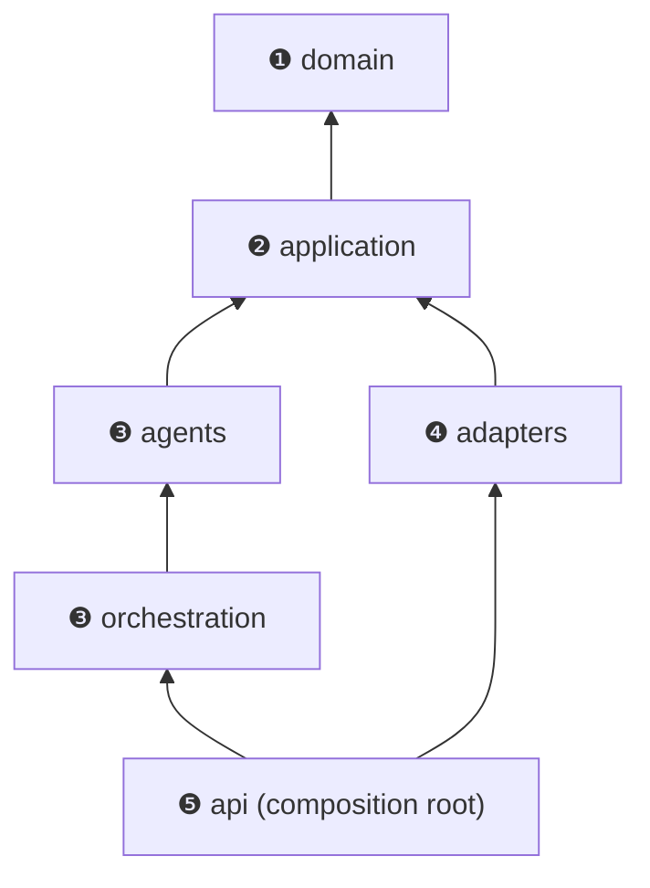

# 13. Folder Structure

```
survey_and_analytics/
├── backend/
│   ├── pyproject.toml              # deps + black/ruff/pylint/pyright/pytest config
│   ├── data/
│   │   ├── question_templates.json # 200 curated templates (generated)
│   │   └── intent_taxonomy.json    # survey types, keywords, stopwords (config, not code)
│   ├── scripts/build_sample_dataset.py
│   ├── src/ifap/
│   │   ├── domain/                 # ❶ pure model: questionnaire, knowledge, intent, events, validation, errors
│   │   ├── application/            # ❷ ports (Protocols), workflow state/DTOs, use-case services
│   │   ├── agents/                 # ❸ agent framework + builtin/ plugins (intent, retrieval, builder, validation)
│   │   ├── orchestration/          # ❸ LangGraph WorkflowOrchestrator
│   │   ├── adapters/               # ❹ knowledge (chroma, in-memory, embeddings, json source), llm, persistence, events
│   │   ├── api/                    # ❺ FastAPI app, routers, schemas, container.py (composition root)
│   │   ├── config/                 #    typed settings (pydantic-settings)
│   │   ├── observability/          #    structlog + OpenTelemetry
│   │   └── main.py                 #    ASGI entry point
│   └── tests/
│       ├── unit/  integration/  architecture/
│       └── conftest.py
├── frontend/                       # Next.js 16 · React 19 · TypeScript strict · Tailwind 4
│   ├── app/                        # layout + chat/editor page
│   ├── components/                 # ChatPanel, QuestionnaireEditor, QuestionCard
│   └── lib/                        # api client + contract types
├── infrastructure/docker/          # backend & frontend Dockerfiles
├── docs/                           # these 15 documents
├── .github/workflows/ci.yml
├── docker-compose.yml
└── Makefile
```


Arrows mean "depends on", and they always point inward. `tests/architecture` enforces this.
