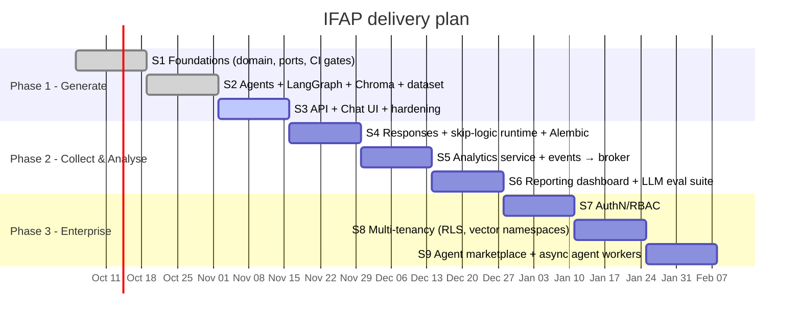

# 14. Sprint Plan (2-week sprints)

| Sprint | Goal | Key stories | Exit criteria |
|---|---|---|---|
| S1 | Foundations | Domain model, ports, settings, observability, CI with all gates | `make check` green |
| S2 | Intelligence | Agent framework, 4 agents, LangGraph orchestrator, 200-question dataset, Chroma + ingestion | Pipeline test passes offline |
| S3 | Experience | Generate/revise/publish API, chat + editor UI, Docker Compose | Demo: describe → edit → publish |
| S4 | Responses | `/responses`, runtime skip-logic evaluation, file uploads, Alembic | Respondent can complete a survey |
| S5 | Analytics | Analytics Agent subscribed to `ResponseSubmitted`, aggregates, broker + outbox | Metrics per question |
| S6 | Reporting | Dashboard, Insights Agent, LLM eval harness | Golden-set score ≥ target |
| S7 | Security | OIDC, RBAC roles, audit log | Pen-test findings closed |
| S8 | Tenancy | Tenant context, RLS, per-tenant vector namespaces & quotas | Isolation tests pass |
| S9 | Ecosystem | Agent marketplace, per-tenant pipelines, async workers | 3rd-party agent installed with no core change |

Phase 1 (S1–S3) is what this repository delivers.
