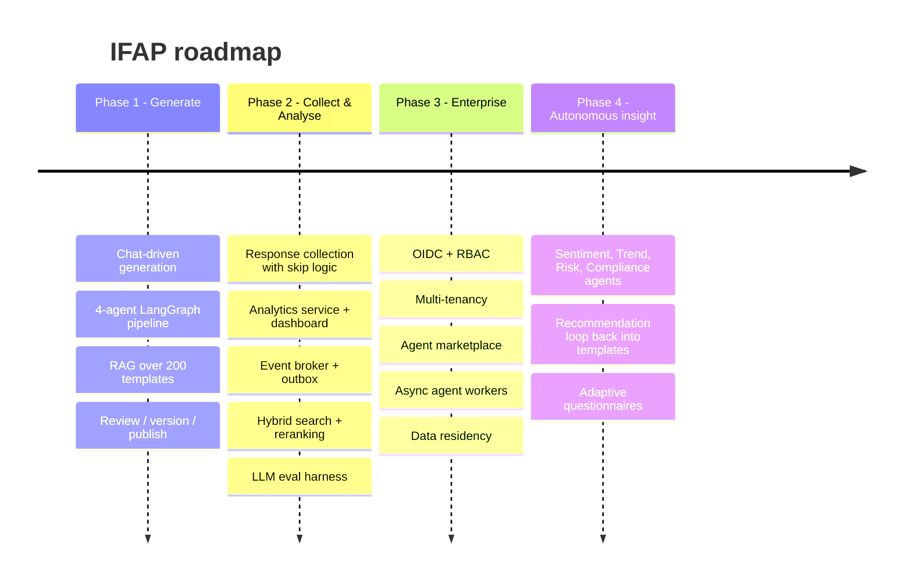

# 15. Future Roadmap

## Phase 2 - Collect & Analyse
- `Response` aggregate and a skip-logic runtime evaluator (reusing `DependencyRule`).
- Analytics Agent: distributions, NPS/CSAT/eNPS scoring keyed off `business_tags`.
- Reporting dashboard (Next.js + charts). Export to CSV/Power BI.
- Kafka / Azure Service Bus via the `EventPublisher` port, with a transactional outbox.
- RAG: hybrid BM25+vector, cross-encoder rerank, MMR, and production embeddings.
- Streaming generation (SSE) so the UI shows agents completing live.

## Phase 3 - Enterprise
- RBAC (author, reviewer, respondent, analyst, admin) and approval workflow (LangGraph interrupt).
- Multi-tenancy: tenant id in `WorkflowState`, Postgres RLS, vector namespaces, per-tenant
  pipelines and token budgets.
- Agent marketplace: catalogue from `AgentDescriptor` (capabilities, version), enable/disable per
  tenant, canary versions.
- Async agent workers scaled by queue depth (KEDA).

## Phase 4 - Autonomous insight
Insights → Recommendation → template improvement loop: low-performing questions (high skip rate,
low variance) are flagged by the Quality Agent and improved templates are proposed back to the
knowledge base for human approval.

## Technical debt register (from Phase 1)
| Item | Plan |
|---|---|
| `create_all` instead of migrations | Alembic in S4 |
| Hashing embedder | Production embeddings + re-index job |
| In-process event bus | Broker + outbox |
| No auth | OIDC in S7 |
| Frontend types hand-written | OpenAPI codegen |
